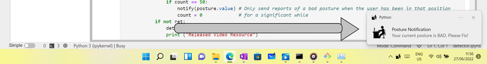

# Posture-Detector


**Posture Detector** was built by and intended for programmers (or really anyone who uses their computer a ton). It detects sitting position using the device camera and sends a notification any time the user of the computer has taken a bad sitting posture.
<br> <br>
Its overall aim is to correct (or at least notify) the sitting postures of hundreds of thousands of programmers who are forced to take really bad postures for prolonged hours of programming sometimes.

# ___________________________________________________________

# Built Using

- [Python](https://python.org)
- [FastAI](https://fast.ai)
- [OpenCV](https://opencv.org)
- [Plyer](https://pypi.org/project/plyer/)
- [Fastbook](https://github.com/fastai/fastbook)
- [PIL](https://pypi.org/project/Pillow/)
- Others

# Prerequisites and Installation

<ul>
    <div> <li> <a href = 'https://www.python.org'> Python </a> </li>
        
    python detector.py
        
</div>
</ul>

# Project Structure

```
.
├── README.md
├── demo-notification.png
├── detector.ipynb
├── detector.py
├── man-sitting-on-computer.png
├── notify-icon.ico
├── posture_detector_model.pkl
└── train.ipynb
```

# Usage

> Posture-Detector can be run either as an executable script [detector.py](detector.py) or as jupyter notebook [detector.ipynb](detector.ipynb). Once run, the camera turns on and it starts detecting in the background with no distracting camera interface. If it thinks your posture is bad, you will be notified.

> If you wish to fine-tune Posture-Detector to adapt more to your own personal working environment, open [train.ipynb](train.ipynb) and follow the listed instructions.

# Demo



Sample notification sent whenever a bad posture is taken for a significant amount of time.

# Reference

- [Fastbook](https://github.com/fastai/fastbook)

# Contact

Dahir Ibrahim (Deedax Inc) - http://instagram.com/deedax_inc <br>
Email - suhayrid6@gmail.com <br>
YouTube - https://www.youtube.com/channel/UCqvDiAJr2gRREn2tVtXFhvQ <br>
Project Link - https://github.com/Daheer/Driving-Environment-Detector
